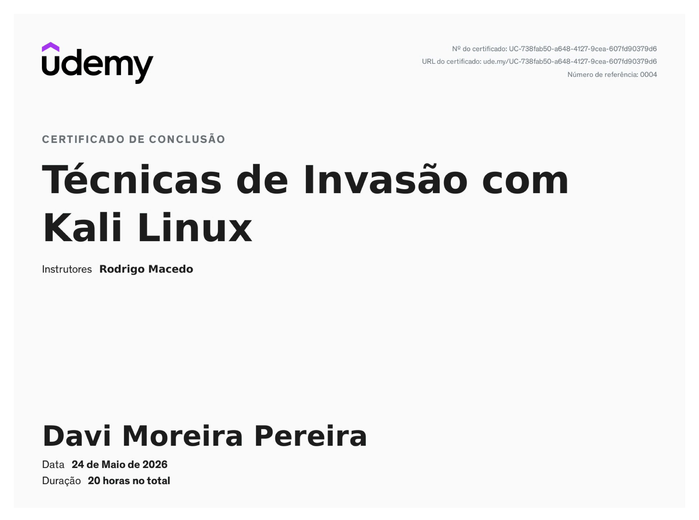
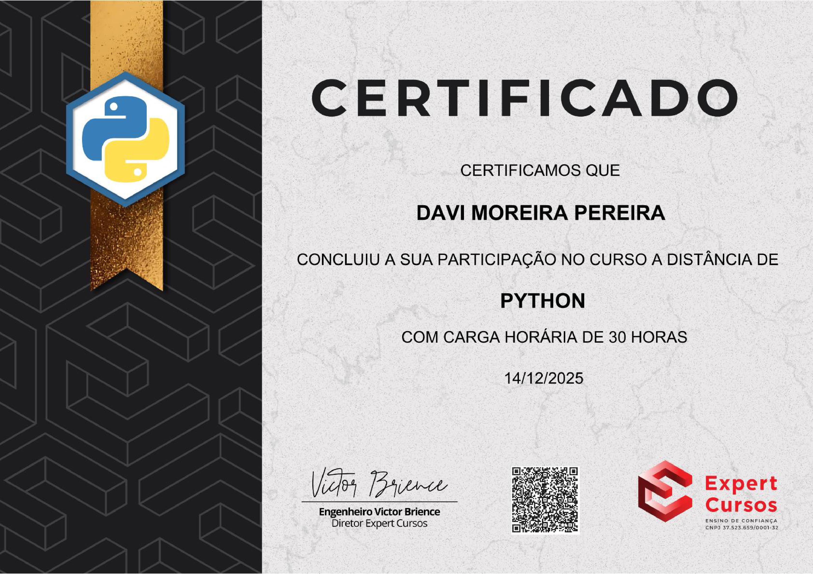

# 🎓 My Certificates

This repository contains my professional and course completion certificates. Click the images to open the full-size files in the `Certificates/` folder.

## Certificates

### 🛡️ Google Cybersecurity
**Platform:** Coursera  
**Specialization:** Google Cybersecurity

---

### 🔐 Ethical Hacking (CEH)
**Platform:** Coursera  
**Specialization:** Ethical Hacking (CEH)

---

### 🐉 Invasion Techniques with Kali Linux
**Platform:** Udemy  
**Course:** Invasion Techniques with Kali Linux

---

### 💻 Python
**Platform:** Hotmart  
**Course:** Python

---

## Contact
If you need to reach me, email: [moreiradavi336@gmail.com](mailto:moreiradavi336@gmail.com)

## Notes
- Original certificate files are stored in the `Certificates/` folder.
- Some filenames contain spaces (they are URL-encoded in links). I can rename files to remove spaces and update the README if you prefer.
- To improve README load performance, I used HTML to display smaller, linked images (no new thumbnail files were created). If you want actual thumbnails (smaller image files), I can generate them and update this README to use the thumbnails linking to originals.

---

Last updated: 2026-08-30
